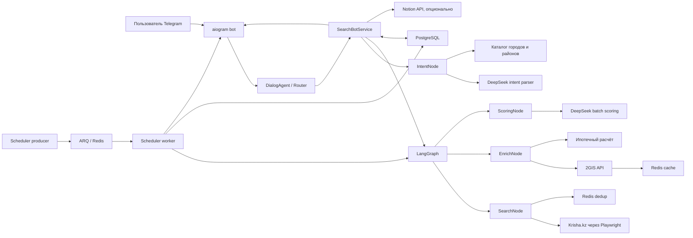
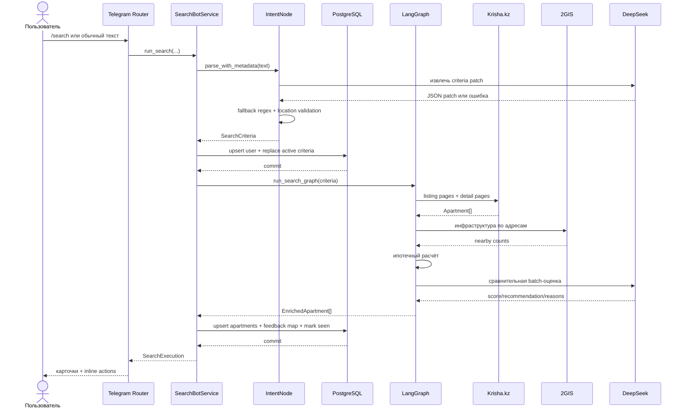
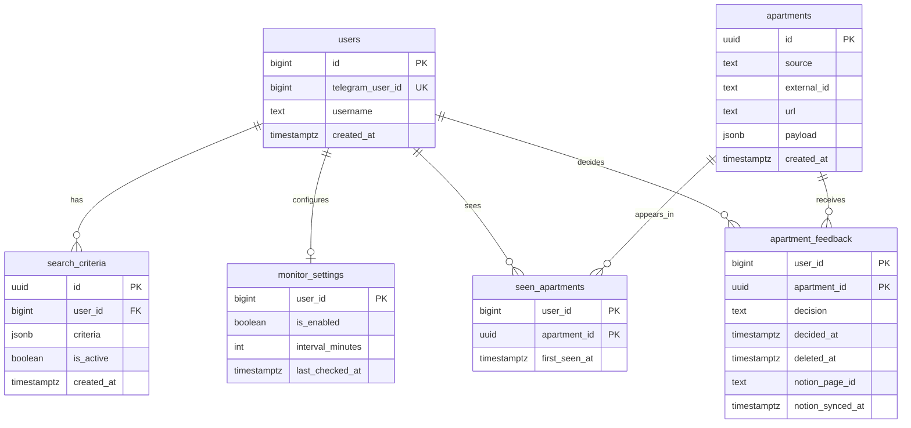
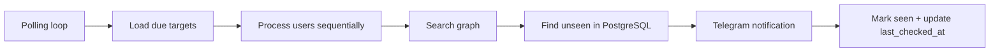
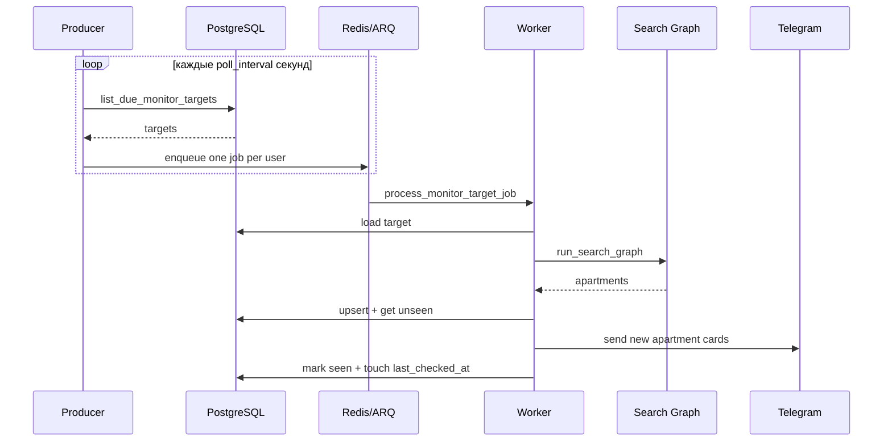

# Архитектура Krisha Agent

Актуальность документа: 1 июля 2026 года.

## 1. Назначение системы

Krisha Agent — специализированный Telegram-ассистент для поиска и мониторинга
объявлений о квартирах на Krisha.kz.

Система решает четыре связанные задачи:

1. принимает поисковый запрос на естественном языке;
2. преобразует запрос в проверяемые структурированные критерии;
3. собирает, обогащает и ранжирует объявления;
4. запоминает действия пользователя и периодически сообщает о новых вариантах.

Это не система реального времени: Krisha.kz не предоставляет приложению поток
событий или webhook. Новые объявления обнаруживаются периодическим повторным
поиском. Также текущий LangGraph является линейным workflow, а не набором
автономных агентов, которые независимо планируют и делегируют задачи.

## 2. Технологический стек

| Область | Технология | Роль |
|---|---|---|
| Язык | Python 3.12 | Основной runtime |
| Telegram | aiogram 3 | Команды, сообщения, callback-кнопки и FSM |
| Workflow | LangGraph | Pipeline `search → enrich → score` и checkpoints |
| Валидация | Pydantic 2 | Доменные модели и конфигурация |
| База данных | PostgreSQL 16 | Пользователи, критерии, объявления, feedback и monitoring |
| ORM и миграции | SQLAlchemy 2 async, Alembic | Доступ к данным и развитие схемы |
| Cache/queue/state | Redis 7 | FSM, ARQ, дедупликация парсинга и cache 2GIS |
| Scraping | Playwright, BeautifulSoup | Получение и разбор Krisha.kz |
| LLM | DeepSeek OpenAI-compatible API | Разбор запроса и сравнительная оценка квартир |
| Геоданные | 2GIS API | Геокодирование и подсчёт инфраструктуры |
| Background jobs | ARQ | Очередь задач мониторинга и cron canary |
| Экспорт | Notion API | Опциональная синхронизация сохранённых квартир |
| Observability | logging, Sentry, LangSmith | Логи, ошибки и трассировка LangGraph |
| Развёртывание | Podman Compose, GHCR | Контейнерный runtime и production image |

## 3. Общая схема



Главный синхронный путь проходит от Telegram к `SearchBotService`, затем к
LangGraph и обратно. Фоновый путь начинается в scheduler, но использует тот же
поисковый pipeline и те же данные пользователя.

## 4. Структура репозитория

```text
agent/
  graph.py                 Сборка и запуск LangGraph
  locations/               Доверенный каталог городов и районов Казахстана
  models/                  Pydantic-модели предметной области
  nodes/                   Intent, search, enrich и scoring nodes
  tools/                   Krisha, DeepSeek, 2GIS, Notion, mortgage, retry

bot/
  app.py                   Bootstrap aiogram, Redis FSM и DI
  router.py                Команды, сообщения и callback handlers
  dialog_agent.py          Маршрутизация свободного текста
  service.py               Application service и бизнес-сценарии
  card_sender.py           Отправка карточек с фото/text fallback
  preferences.py           Объяснимое ранжирование /foryou
  monitoring.py            Разбор и форматирование интервалов
  formatters.py            Пользовательские тексты
  keyboards.py             Inline-клавиатуры
  states.py                FSM states

db/
  models.py                SQLAlchemy-модели
  repositories.py          Запросы и upsert-операции
  session.py               Async engine и session factory
  checkpoints.py           PostgreSQL saver для LangGraph

scheduler/
  app.py                   Inline/ARQ runtime и polling loop
  producer.py              Постановка due jobs в ARQ
  jobs.py                  Worker lifecycle и job functions
  arq_worker.py            WorkerSettings и cron
  service.py               Обработка monitor target
  notifier.py              Telegram-уведомления
  canary.py                Контроль работоспособности парсера

config/
  settings.py              Типизированная конфигурация из environment
  observability.py         Logging, Sentry и LangSmith

alembic/                   Миграции PostgreSQL
deploy/                    Bootstrap VPS и systemd-интеграция
tests/                     Unit и integration tests
```

## 5. Точки входа и процессы

### 5.1 Telegram bot

Команда запуска:

```bash
python -m bot
```

`bot.__main__` вызывает `bot.app.main()`. При запуске:

1. настраиваются logging, Sentry и LangSmith;
2. создаётся `aiogram.Bot`;
3. создаётся `Dispatcher` с `RedisStorage`;
4. собирается `SearchBotService`;
5. подключается router;
6. Telegram получает список команд через `set_my_commands`;
7. запускается long polling.

Redis FSM делает состояния диалога устойчивыми к перезапуску процесса bot.

### 5.2 Scheduler producer

Команда запуска:

```bash
python -m scheduler
```

Поведение зависит от `SCHEDULER__RUNTIME`:

- `inline` — scheduler сам ищет due users и последовательно обрабатывает их;
- `arq` — scheduler только ставит отдельную задачу на пользователя в Redis.

Цикл повторяется через `SCHEDULER__POLL_INTERVAL_SECONDS`, по умолчанию раз в
60 секунд. Это частота проверки очереди пользователей, а не частота поиска для
каждого пользователя. Персональная частота хранится в `monitor_settings`.

### 5.3 ARQ worker

Команда запуска:

```bash
arq scheduler.arq_worker.WorkerSettings
```

Worker:

1. на startup создаёт Telegram bot и `SchedulerService`;
2. получает `process_monitor_target_job`;
3. выполняет поиск для конкретного Telegram user;
4. отправляет новые карточки;
5. закрывает Telegram session на shutdown.

Если canary включён, worker также запускает проверку парсера по cron.

### 5.4 Database migrations

Миграции выполняются отдельным one-shot процессом:

```bash
alembic upgrade head
```

## 6. Telegram-слой

### 6.1 Поддерживаемые команды

| Команда | Назначение |
|---|---|
| `/start` | Регистрация пользователя и справка |
| `/help` | Справка |
| `/search <текст>` | Новый поиск |
| `/refine <текст>` | Изменение активных критериев |
| `/criteria` | Показ активных критериев |
| `/list` | Сохранённые квартиры |
| `/trash` | Отклонённые и удалённые из сохранённых |
| `/foryou` | Новые варианты с учётом вкуса пользователя |
| `/monitor` | Статус, включение, выключение и интервал мониторинга |
| `/cancel` | Выход из режима уточнения |

Кроме команд поддерживаются обычные текстовые сообщения и inline-кнопки.

### 6.2 Router

`bot/router.py` является транспортным слоем. Он:

- извлекает Telegram user id и username;
- проверяет аргументы команд;
- переключает FSM;
- показывает уведомление о начале долгого поиска;
- вызывает методы `SearchBotService`;
- преобразует доменный результат в сообщения и карточки;
- обрабатывает callback-кнопки.

Основные callback-действия:

- показать следующую порцию результатов;
- открыть уточнение критериев;
- сохранить или отклонить конкретную квартиру;
- открыть сохранённые;
- удалить сохранённую квартиру;
- восстановить запись из корзины;
- удалить запись из корзины окончательно.

### 6.3 DialogAgent

`DialogAgent` обслуживает свободный текст без slash-команды. Сначала
`DialogIntentNode` классифицирует сообщение в одно из действий:

- новый поиск;
- уточнение;
- показать сохранённое;
- показать критерии;
- показать monitor status;
- показать помощь.

Это правило-ориентированная маршрутизация по маркерам. После выбора действия
`DialogAgent` вызывает соответствующий метод `SearchBotService`.

Важно различать два уровня:

- `DialogIntentNode` выбирает пользовательский сценарий;
- `agent.nodes.IntentNode` извлекает поля `SearchCriteria`.

### 6.4 FSM

FSM используется для многошаговых состояний:

- ожидание текста уточнения;
- ожидание обратной связи после выдачи результатов.

Состояние хранится в Redis, поэтому не зависит от памяти одного процесса.

### 6.5 Карточки

Результат отправляется по одной карточке на квартиру. Карточка содержит
основные характеристики, результат обогащения, score и причины рекомендации.
Если фотографию нельзя отправить, `card_sender` деградирует до текстового
сообщения. Inline-кнопки привязаны к `external_id`, а не к позиции в выдаче.

## 7. Разбор пользовательского запроса

### 7.1 Целевая модель

Запрос преобразуется в `SearchCriteria`:

- Telegram user id;
- город;
- тип сделки: `sale` или `rent`;
- тип недвижимости: `apartment`;
- минимальная и максимальная цена;
- допустимое число комнат;
- районы;
- минимальная и максимальная площадь;
- число страниц Krisha для проверки.

Pydantic проверяет типы, диапазоны и непротиворечивость данных.

### 7.2 LLM-first с детерминированным fallback

`IntentNode` сначала пытается вызвать `LLMIntentParser` через DeepSeek.
LLM возвращает только частичный `IntentCriteriaPatch`, который повторно
валидируется Pydantic.

Если LLM:

- недоступен;
- вернул ошибку;
- вернул невалидные данные;
- не извлёк ни одного значения,

используется regex parser. Он понимает цены в тенге, тысячах и миллионах,
диапазоны, площадь, комнаты цифрами и словами, разговорные формы вроде
«двушка», тип сделки и page limit.

Таким образом, LLM улучшает понимание текста, но не является единственной
точкой работоспособности поиска.

### 7.3 Локации

Города и районы не принимаются напрямую на доверии от LLM. Они проходят через
локальный каталог `agent/locations/kz_locations.json`.

Location resolver:

- нормализует русские, казахские и альтернативные названия;
- исправляет некоторые опечатки через fuzzy matching;
- проверяет принадлежность района городу;
- не допускает неоднозначный район без города;
- проверяет наличие рабочего Krisha slug;
- сохраняет существующий город/район при refinement, если пользователь их не менял;
- использует Алматы по умолчанию и сообщает об этом пользователю.

Это отделяет вероятностное извлечение текста от детерминированной валидации
географии.

## 8. Application service

`SearchBotService` является центральным use-case слоем. Router не работает с
репозиториями и LangGraph напрямую.

Service отвечает за:

- регистрацию Telegram user;
- новый поиск и refinement;
- хранение активных критериев;
- запуск LangGraph;
- преобразование технических ошибок в понятные сообщения;
- запись найденных квартир;
- пользовательскую историю `seen`;
- сохранение и отклонение;
- корзину и восстановление;
- `/foryou`;
- настройки мониторинга;
- best-effort синхронизацию с Notion.

Транзакции открываются на уровне service methods. Внешний поиск выполняется
вне транзакции хранения критериев, чтобы не удерживать DB transaction на всё
время Playwright и HTTP-запросов.

## 9. Полный поток ручного поиска



Пошагово:

1. Router сообщает пользователю, что поиск начался.
2. `IntentNode` создаёт `SearchCriteria`.
3. Service сохраняет критерии как активные.
4. Graph запускается с `thread_id=telegram-user:<id>` и namespace
   `telegram-search`.
5. Результаты сохраняются в `apartments`.
6. Создаются связи `seen_apartments`.
7. Квартиры с уже существующим feedback (`saved` или `rejected`) удаляются из
   новой ручной выдачи.
8. Router отправляет результат.

Действие «показать ещё» повторно запускает те же критерии. Redis claims и
история feedback помогают не возвращать уже показанные варианты.

## 10. LangGraph pipeline


State `SearchGraphState` содержит:

- `criteria: SearchCriteria`;
- `apartments: list[Apartment]`;
- `enriched_apartments: list[EnrichedApartment]`.

`build_search_graph` позволяет отключить enrich или scoring для тестов и
частных сценариев. Production default включает все три узла.

При наличии `thread_id` используется официальный PostgreSQL checkpointer
LangGraph. Checkpoint namespace разделяет ручной поиск и monitoring. Историю
состояний можно получить через `get_search_graph_state_history`.

Pipeline линейный: в нём нет динамического планировщика, циклов рассуждения или
делегирования между несколькими автономными агентами.

## 11. SearchNode и Krisha parser

### 11.1 Browser lifecycle

Для одного graph run:

1. запускается headless Chromium;
2. создаётся browser context с `ru-RU` locale и случайным User-Agent;
3. parser открывает страницы;
4. context и browser гарантированно закрываются через async context manager.

### 11.2 Построение URL

Parser использует реальные фильтры Krisha `das[...]` для цены, комнат и
площади. Город преобразуется в проверенный slug из location catalog.

Районы Krisha представлены непрозрачными идентификаторами, поэтому район
дополнительно проверяется локально:

1. на preview-карточке;
2. повторно после разбора detail page.

Известное несовпадение отбрасывается сразу. Неизвестное значение допускается
до detail page, чтобы не потерять объявление из-за неполной карточки.

### 11.3 HTML parsing

`KrishaHtmlParser` является отдельным чистым HTML parser. Он извлекает:

- external id;
- URL;
- заголовок;
- цену;
- комнаты;
- площадь;
- этаж;
- район и адрес;
- фотографии;
- дату публикации.

Разделение browser I/O и чистого HTML parsing позволяет тестировать селекторы
на локальных fixtures без запуска браузера.

### 11.4 Ограничение объёма

Parser сначала собирает preview, удаляет дубликаты и проверяет критерии. Detail
pages загружаются только для подходящих кандидатов и только до
`PARSER__MAX_RESULTS` — по умолчанию шесть результатов.

Это ограничивает:

- время ответа;
- нагрузку на Krisha;
- число 2GIS-запросов;
- размер LLM prompt.

### 11.5 Антибот и таймауты

Между запросами выполняется случайная пауза от
`PARSER__MIN_DELAY_SECONDS` до `PARSER__MAX_DELAY_SECONDS`, по умолчанию
1–3 секунды.

HTTP 429 и HTML-маркеры captcha/access denied преобразуются в
`AntiBotBlockedError`. Timeout отдельной detail page освобождает Redis claim и
позволяет продолжить со следующими кандидатами. Если все listing pages
завершились timeout, ошибка поднимается выше.

### 11.6 Redis claims

До detail page parser атомарно создаёт Redis key через `SET NX`:

```text
namespace + user_id + external_id
```

Claim имеет TTL. Это:

- предотвращает повторную дорогостоящую обработку одного объявления;
- разделяет пользователей;
- позволяет `/foryou` использовать отдельный namespace;
- автоматически восстанавливается после истечения TTL.

Если detail parsing завершился ошибкой или квартира не прошла финальную
проверку, claim удаляется.

## 12. EnrichNode

Каждый `Apartment` преобразуется в `EnrichedApartment`.

Добавляются:

- число школ в радиусе;
- число парков;
- число станций метро;
- примерный ежемесячный ипотечный платёж;
- примерная переплата.

Квартиры обогащаются конкурентно через `asyncio.gather`. Для одной квартиры
запрос 2GIS и ипотечный расчёт запускаются параллельно.

### 12.1 2GIS

2GIS flow:

1. адрес геокодируется в `lat/lon`;
2. считаются школы, парки и метро в заданном радиусе;
3. transient HTTP errors проходят через retry с backoff;
4. геокодирование и counts кешируются в Redis.

TTL cache:

- успешный geocode — примерно 30 дней;
- geocode miss — один день;
- nearby counts — семь дней.

Отсутствующие данные представлены `None`, а не нулём. Это важно для scoring:
`None` означает «не удалось получить данные», а `0` — «объектов действительно
нет».

### 12.2 Ипотека

Используется аннуитетная формула. Production default:

- кредит — 80% стоимости квартиры;
- срок — 20 лет;
- ставка — из `StaticInterestRateProvider`.

Это ориентировочный расчёт, а не банковское предложение.

Если 2GIS или rate provider недоступен, квартира остаётся в результате без
соответствующего enrichment.

## 13. ScoringNode

Вся короткая выборка отправляется в DeepSeek одним запросом. Batch scoring
выбран для сравнительной оценки: LLM видит все варианты и может отделить лучший
от худшего.

В prompt передаются:

- активные критерии покупателя;
- цена и цена за квадратный метр;
- комнаты, площадь и этаж;
- район;
- nearby counts;
- ипотечный платёж.

DeepSeek должен вернуть JSON:

```json
{
  "items": [
    {
      "index": 1,
      "score": 84,
      "recommendation": "strong_buy",
      "reasons": ["низкая цена за м²", "подходящий район"]
    }
  ]
}
```

Каждый элемент повторно валидируется моделью `ApartmentScore`. После этого
квартиры сортируются по score по убыванию, а варианты без score опускаются в
конец.

При HTTP error, невалидном JSON или неполном результате выполняется retry с
backoff и jitter. При окончательной ошибке pipeline не падает: объявления
возвращаются без score.

## 14. Feedback, корзина и персонализация

### 14.1 Feedback

Пользователь может принять одно из решений:

- `saved`;
- `rejected`.

Feedback хранится на пару `(user_id, apartment_id)`, поэтому одно объявление
может иметь разные решения у разных пользователей.

Сохранённые и отклонённые варианты не возвращаются в обычной новой выдаче.

### 14.2 Корзина

Удаление из сохранённых является soft delete через `deleted_at`. Поэтому
квартиру можно вернуть через `/trash`.

Корзина объединяет:

- отклонённые квартиры;
- удалённые из сохранённых.

Восстановление:

- снимает `deleted_at` у сохранённой;
- либо удаляет решение `rejected`, чтобы квартира снова могла появиться.

Окончательное удаление из корзины оставляет квартиру скрытой и делает действие
невосстановимым для пользователя.

### 14.3 `/foryou`

`/foryou` требует:

- активные критерии;
- хотя бы одну сохранённую квартиру.

Service запускает свежий поиск с отдельным Redis namespace `foryou`, после
чего строит объяснимый `PreferenceProfile`.

Сигналы вкуса:

- понравившиеся и непонравившиеся районы;
- диапазон цен сохранённых квартир;
- диапазон площади;
- количество комнат.

Финальный порядок объединяет:

1. соответствие сохранённым предпочтениям;
2. соответствие активным критериям;
3. criteria-aware DeepSeek score.

Алгоритм детерминированный и возвращает причины вроде «район как в
сохранённых» или «бюджет в вашем диапазоне». Дополнительный LLM-вызов для
персонализации не нужен.

## 15. Notion sync

Notion включается только при наличии:

- `NOTION__ENABLED=true`;
- API token;
- database id.

Sync запускается после сохранения квартиры:

1. feedback сначала фиксируется в PostgreSQL;
2. затем вызывается Notion;
3. при успехе сохраняются `notion_page_id` и `notion_synced_at`;
4. повторное сохранение обновляет существующую страницу.

Интеграция best effort: недоступность Notion не откатывает локальное
сохранение и не ломает основной пользовательский сценарий.

## 16. PostgreSQL

### 16.1 Основные таблицы



### 16.2 Инварианты

- `telegram_user_id` уникален;
- квартира уникальна по `(source, external_id)` и по URL;
- `seen_apartments` уникальна на пару user/apartment;
- feedback уникален на пару user/apartment;
- decision ограничен значениями `saved` и `rejected`;
- активные критерии индексируются по user и `is_active`;
- feedback имеет составной индекс под user/decision/deleted/order.

### 16.3 JSONB payload

Полный `EnrichedApartment` хранится в `apartments.payload`. Это упрощает
восстановление карточки без повторного обращения к внешним API. Отдельные
колонки хранят идентификаторы и URL, необходимые для поиска и upsert.

### 16.4 Repository layer

`db/repositories.py` содержит запросы, но не решает, когда делать commit.
Граница транзакции находится в application service или scheduler service.

Ключевые группы операций:

- upsert пользователя;
- замена активных критериев;
- upsert объявлений;
- mark/list unseen;
- feedback, trash и restore;
- monitor settings и due targets;
- очистка устаревших записей.

### 16.5 LangGraph checkpoints

Checkpoint tables создаются официальным `AsyncPostgresSaver`. Они отделены от
доменных SQLAlchemy-моделей и используются для истории состояния graph runs.

## 17. Redis

Один Redis instance выполняет несколько логически разных ролей:

| Роль | Данные |
|---|---|
| Telegram FSM | Текущее состояние диалога |
| ARQ | Очередь monitor jobs и job metadata |
| Parser dedup | Claims по namespace/user/external id |
| 2GIS cache | Геокодирование и nearby counts |

Данные разделены ключами и TTL. В production Redis защищён паролем, использует
AOF и публикуется только на `127.0.0.1`.

PostgreSQL остаётся источником долговременной бизнес-истины. Redis используется
для временного состояния, очередей и оптимизации.

## 18. Фоновый мониторинг

Пользователь включает monitoring и выбирает интервал. По умолчанию interval
равен 360 минутам.

Due target — пользователь, у которого:

- monitoring включён;
- есть активные критерии;
- поиск ещё не выполнялся либо с `last_checked_at` прошёл interval.

### 18.1 Inline mode



Inline mode проще, но поиск одного пользователя задерживает обработку
следующего.

### 18.2 ARQ mode



Job id включает Telegram user id и минутный time bucket. Это уменьшает
вероятность повторной постановки одинаковой задачи в одном цикле.

ARQ timeout и число попыток задаются через environment.

### 18.3 Определение новых квартир

Parser-level Redis dedup уменьшает повторную обработку, но окончательное
решение о пользовательском уведомлении принимает PostgreSQL:

1. результаты upsert-ятся;
2. выбираются записи без связи в `seen_apartments`;
3. уведомление отправляется только для них;
4. после успешной отправки они помечаются как seen;
5. обновляется `last_checked_at`.

Если Telegram notifier падает, commit не выполняется, поэтому запись не будет
ошибочно считаться доставленной.

### 18.4 Очистка

В ARQ producer runtime раз в сутки запускается очистка:

- старых inactive criteria;
- старых `seen_apartments`;
- неиспользуемых старых apartment records.

## 19. Parser canary

Scraping зависит от HTML Krisha, поэтому scheduler может запускать canary.

Canary:

1. открывает широкую эталонную выдачу;
2. проверяет наличие preview;
3. проверяет распознавание цены, комнат или площади;
4. открывает одну detail page;
5. проверяет фото и адрес;
6. различает anti-bot block и поломку parsing;
7. логирует результат;
8. при ошибке отправляет сообщение admin chat.

Canary не создаёт dedup claims и не влияет на данные реального пользователя.

## 20. Обработка ошибок и деградация

| Сбой | Поведение |
|---|---|
| DeepSeek intent parser недоступен | Regex fallback |
| Неизвестный/противоречивый город или район | Понятная validation error пользователю |
| Krisha вернул 429/captcha | Отдельное сообщение об anti-bot ограничении |
| Krisha timeout | Ошибка поиска либо пропуск отдельной detail page |
| 2GIS недоступен | Квартира остаётся без nearby data |
| Interest rate provider недоступен | Квартира остаётся без mortgage data |
| DeepSeek scoring недоступен | Квартиры возвращаются без score |
| Notion недоступен | Локальное сохранение остаётся успешным |
| Один monitor target упал | Ошибка логируется, остальные targets продолжают работу |
| Telegram notification упала | Квартиры не помечаются доставленными |
| Parser canary упал | Worker продолжает работу, admin получает alert при возможности |

Главный принцип — необязательное enrichment не должно удалять исходное
объявление. Критические ошибки поиска, напротив, поднимаются до service и
превращаются в безопасное пользовательское сообщение.

## 21. Observability

`configure_observability` вызывается в bot, scheduler и ARQ worker.

Он:

- задаёт единый формат Python logging;
- использует `APP__LOG_LEVEL`;
- опционально инициализирует Sentry;
- включает LangSmith через environment variables;
- не выводит секреты;
- не роняет процесс из-за некорректного Sentry DSN.

LangSmith предназначен для трассировки LangGraph, а Sentry — для сбора
необработанных исключений процесса.

## 22. Конфигурация

Настройки загружаются из environment и `.env` через `pydantic-settings`.
Вложенность задаётся двойным подчёркиванием:

```text
DB__HOST
REDIS__PASSWORD
API__DEEPSEEK_API_KEY
SCHEDULER__RUNTIME
```

Основные группы:

- `APP__*` — environment и log level;
- `DB__*` — PostgreSQL;
- `REDIS__*` — Redis;
- `TELEGRAM__*` — bot token;
- `API__*` — 2GIS, DeepSeek, Sentry и LangSmith;
- `PARSER__*` — delay, timeout, TTL и max results;
- `SCORING__*` — model, temperature и timeout;
- `SCHEDULER__*` — runtime, polling, batch и canary;
- `ARQ__*` — queue, timeout и retries;
- `NOTION__*` — optional export.

Секреты представлены `SecretStr`. Настройки валидируются при startup:
например, Notion нельзя включить без token/database id, а parser min delay не
может быть больше max delay.

## 23. Развёртывание

### 23.1 Контейнер

`Containerfile` использует Playwright Python image, чтобы Chromium и системные
зависимости совпадали с версией Playwright.

Build является multi-stage:

1. builder устанавливает `uv` и production dependencies;
2. копирует Python packages;
3. собирает virtual environment;
4. runtime получает готовое приложение;
5. процесс работает от непривилегированного пользователя `pwuser`.

### 23.2 Podman Compose

Сервисы:

- `postgres`;
- `redis`;
- `migrate`;
- `bot`;
- `scheduler-producer`;
- `scheduler-worker`.

PostgreSQL и Redis имеют persistent volumes и healthchecks. Application
services стартуют после healthy datastore. Для логов включена ротация.

Локально image собирается как `localhost/krisha-agent:dev`. Production override
заменяет его на `ghcr.io/modern-messiah/krisha-agent:latest`.

### 23.3 VPS

В `deploy/` находятся:

- bootstrap Ubuntu 24;
- ожидание datastore readiness;
- systemd user service для Podman Compose.

## 24. Тестирование

В репозитории находится 198 тестовых функций:

- 27 unit test files;
- 2 PostgreSQL integration test files.

Проверяются:

- Pydantic models и settings;
- intent parsing и location resolver;
- Krisha HTML/parser behavior и fixtures;
- HTTP retry;
- 2GIS cache и ошибки;
- enrich и scoring nodes;
- LangGraph и checkpoints;
- bot service, router, FSM, callbacks и card sending;
- preference ranking;
- repositories и monitoring на PostgreSQL;
- scheduler, jobs и canary;
- Notion payload;
- observability;
- container/deploy files.

Стандартные команды:

```bash
uv run ruff check .
uv run ruff format --check .
uv run mypy agent bot config db scheduler
uv run pytest
```

Integration tests требуют отдельную disposable PostgreSQL database и помечены
маркером `integration`.

## 25. Производительность и «live tracking»

### 25.1 Скорость ручного поиска

Точное время заранее не гарантируется, потому что оно зависит от:

- числа listing pages;
- числа подходящих preview;
- скорости Krisha;
- 1–3-секундных anti-ban пауз;
- cache hit/miss в 2GIS;
- времени ответа DeepSeek.

Detail pages обрабатываются последовательно, чтобы не создавать агрессивную
нагрузку на Krisha. Enrichment разных квартир выполняется конкурентно, а
scoring всей выборки — одним batch request.

Пользователь видит сообщение о начале поиска, но детального live progress с
процентами или этапами сейчас нет.

### 25.2 Скорость мониторинга

Monitoring является polling-системой:

```text
реальная задержка обнаружения
≈ персональный monitor interval
+ ожидание ближайшего scheduler poll
+ время выполнения search pipeline
```

Уменьшение interval ускоряет обнаружение, но повышает:

- нагрузку на Krisha;
- вероятность anti-bot block;
- расходы 2GIS и LLM;
- нагрузку на worker.

## 26. Текущие ограничения

1. Источник данных основан на scraping, поэтому изменение HTML Krisha требует
   обновления parser selectors.
2. Система не получает объявления в реальном времени.
3. High-level `DialogIntentNode` остаётся rule-based.
4. LangGraph pipeline линейный; называть его полноценной multi-agent системой
   технически неточно.
5. DeepSeek и 2GIS являются внешними зависимостями, хотя предусмотрена
   graceful degradation.
6. Скорость production search не зафиксирована нагрузочными benchmark.
7. Inline scheduler обрабатывает пользователей последовательно; ARQ лучше
   подходит для масштабирования.
8. Redis совмещает FSM, cache, dedup и queue, поэтому его недоступность влияет
   сразу на несколько подсистем.
9. LLM score является рекомендацией, а ипотечный расчёт — оценкой; они не
   заменяют финансовую или юридическую проверку квартиры.
10. Детального пользовательского live tracker выполнения поиска нет.

## 27. Основные архитектурные решения

### Почему Telegram

Не требуется отдельный frontend, авторизация привязана к Telegram user id,
уведомления доступны из коробки.

### Почему LangGraph

Pipeline имеет явные этапы и типизированный state; checkpoints позволяют
хранить историю выполнения. При текущей сложности эту задачу можно было бы
решить и обычной orchestration function — LangGraph оставляет возможность
добавить ветвление и approval steps позднее.

### Почему PostgreSQL и Redis одновременно

PostgreSQL хранит долговременную бизнес-истину и связи между пользователем и
объявлениями. Redis хранит короткоживущее состояние, cache, atomic claims и
очередь.

### Почему LLM плюс regex

LLM лучше понимает свободные формулировки, но может быть недоступен или вернуть
невалидный ответ. Regex fallback обеспечивает базовую предсказуемость.

### Почему batch scoring

Один сравнительный запрос дешевле набора запросов на каждую квартиру и даёт
LLM контекст всей выборки.

### Почему отдельный service layer

Telegram handlers остаются транспортным кодом. Бизнес-сценарии можно
тестировать без Telegram, а repository и graph dependencies подменять
заглушками.

## 28. Карта основных файлов

| Файл | Ответственность |
|---|---|
| [`agent/graph.py`](agent/graph.py) | Сборка и запуск search graph |
| [`agent/nodes/intent_node.py`](agent/nodes/intent_node.py) | LLM/regex criteria extraction |
| [`agent/nodes/search_node.py`](agent/nodes/search_node.py) | Browser lifecycle и вызов parser |
| [`agent/tools/krisha_parser.py`](agent/tools/krisha_parser.py) | Krisha I/O, filtering и dedup |
| [`agent/tools/krisha_html.py`](agent/tools/krisha_html.py) | Чистый HTML parsing |
| [`agent/nodes/enrich_node.py`](agent/nodes/enrich_node.py) | 2GIS и mortgage enrichment |
| [`agent/tools/deepseek_scorer.py`](agent/tools/deepseek_scorer.py) | Batch scoring |
| [`bot/router.py`](bot/router.py) | Telegram transport |
| [`bot/dialog_agent.py`](bot/dialog_agent.py) | Free-text scenario routing |
| [`bot/service.py`](bot/service.py) | Use cases и transaction orchestration |
| [`bot/preferences.py`](bot/preferences.py) | `/foryou` ranking |
| [`db/models.py`](db/models.py) | Relational data model |
| [`db/repositories.py`](db/repositories.py) | Data access |
| [`scheduler/app.py`](scheduler/app.py) | Scheduler runtime |
| [`scheduler/service.py`](scheduler/service.py) | Monitor processing |
| [`scheduler/canary.py`](scheduler/canary.py) | Parser health check |
| [`config/settings.py`](config/settings.py) | Typed configuration |
| [`config/observability.py`](config/observability.py) | Logging and telemetry |
| [`podman-compose.yml`](podman-compose.yml) | Runtime topology |
