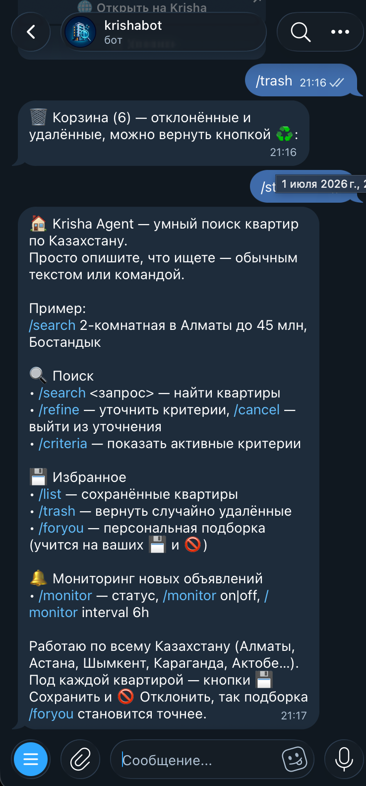
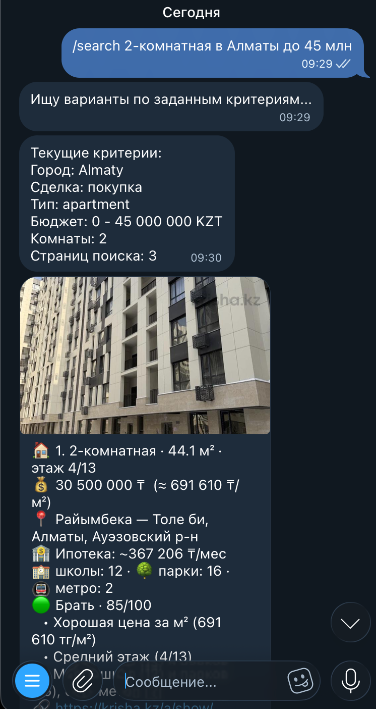
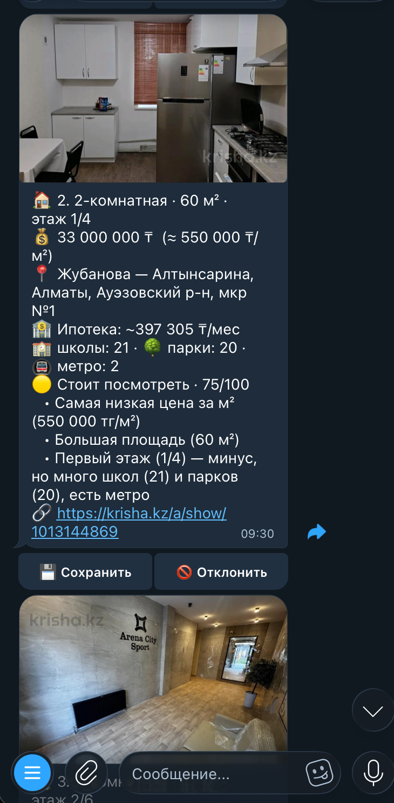

# Krisha Agent

<p align="center">
  
</p>

Autonomous multi-agent system for apartment discovery in Kazakhstan.  
Current scope is **Phase 0 + Phase 7 infra baseline**: foundation, parser, LangGraph search pipeline, enrichment, DeepSeek-backed scoring, checkpoint memory, Telegram bot, persistent monitor settings, ARQ scheduler runtime, Notion export, Podman stack, VPS deploy automation, tests, and CI.

## Tech Stack

- Python 3.12.
- Pydantic + pydantic-settings
- SQLAlchemy 2 (async) + Alembic
- LangGraph (search graph baseline implemented)
- aiogram
- Redis, PostgreSQL
- Playwright + BeautifulSoup (Krisha parser)
- uv, ruff, mypy, pytest, pre-commit
- Podman Compose + GHCR image workflow

## Repository Structure

```text
.
├── agent/
│   ├── graph.py
│   ├── models/
│   ├── nodes/
│   └── tools/
├── bot/
├── config/
├── db/
├── deploy/
├── scheduler/
├── alembic/
│   └── versions/
├── tests/
├── Containerfile
├── podman-compose.yml
└── .github/workflows/ci.yml
```

## Quick Start

1. Install dependencies for local development:

```bash
# uv
curl -LsSf https://astral.sh/uv/install.sh | sh

# pre-commit
python3 -m pip install --user pre-commit

# podman (Ubuntu)
sudo apt-get update && sudo apt-get install -y podman podman-compose
```

2. Clone and enter project:

```bash
git clone https://github.com/Modern-Messiah/Autonomous-Personal-Assistant-AI-Agent-.git
cd Autonomous-Personal-Assistant-AI-Agent-
```

3. Prepare environment:

```bash
cp .env.example .env
```

4. Install Python dependencies:

```bash
uv sync --dev
```

5. Enable pre-commit:

```bash
pre-commit install
```

## Development Commands

```bash
# lint
uv run ruff check .

# format
uv run ruff format .

# type check
uv run mypy agent bot config db scheduler

# tests
uv run pytest
```

## Database Migrations

```bash
# apply migrations
uv run alembic upgrade head

# create new migration
uv run alembic revision -m "describe_change"
```

Alembic reads connection settings from:
- `DATABASE_URL` (if provided), or
- `DB__*` variables from `.env` / environment.

## Environment Variables

The project uses nested settings via `pydantic-settings` and `env_nested_delimiter="__"`:

- `APP__ENV`, `APP__LOG_LEVEL`
- `DB__HOST`, `DB__PORT`, `DB__NAME`, `DB__USER`, `DB__PASSWORD`
- `REDIS__HOST`, `REDIS__PORT`, `REDIS__DB`, `REDIS__PASSWORD`
- `TELEGRAM__BOT_TOKEN`
- `API__TWO_GIS_API_KEY`, `API__DEEPSEEK_API_KEY`
- optional `API__LANGSMITH_API_KEY` + `API__LANGSMITH_PROJECT` (both enable tracing)
- optional `API__SENTRY_DSN` (enables Sentry error reporting)
- `NOTION__ENABLED`, `NOTION__API_TOKEN`, `NOTION__DATABASE_ID`, `NOTION__TIMEOUT_SECONDS`
- `SCHEDULER__RUNTIME`, `SCHEDULER__POLL_INTERVAL_SECONDS`, `SCHEDULER__BATCH_SIZE`
- `ARQ__QUEUE_NAME`, `ARQ__JOB_TIMEOUT_SECONDS`, `ARQ__MAX_TRIES`

See `.env.example` for the full contract.

## Current Status

- Implemented:
  - Project foundation and tooling.
  - Pydantic models (`SearchCriteria`, `Apartment`, `ApartmentScore`, `EnrichedApartment`).
  - SQLAlchemy async schema + Alembic init migration.
  - `KrishaParser` (Playwright-first), anti-bot fallback, randomized UA support, Redis-based dedup.
  - `IntentNode` (rule-based text -> `SearchCriteria`) and `run_search_graph_from_text`.
  - `SearchNode` + `run_search_graph` pipeline on LangGraph.
  - `EnrichNode` with mortgage annuity calculation and 2GIS nearby summary client.
  - `ScoringNode` with DeepSeek JSON scoring and graceful fallback on scorer errors.
  - Optional Postgres-backed LangGraph checkpointing via `thread_id` and official saver integration.
  - Telegram bot baseline on `aiogram` with `/start`, `/search`, `/criteria`, user registration, and active criteria persistence.
- Supervisor-style dialog agent for free-text turns, refinement routing, and natural-language fallback without explicit commands.
  - Dialog refinement baseline with `/refine`, `/cancel`, FSM-based follow-up text, and inline "Сохранить" / "Отклонить" / "Уточнить критерии" actions after search results.
  - Search result persistence in `apartments` / `seen_apartments`, plus `apartment_feedback` memory for explicit `saved/rejected` decisions and `/list` for saved apartments.
  - Optional Notion sync for saved apartments with local `page_id` metadata for idempotent updates.
  - Persistent monitor settings with `/monitor`, `/monitor on|off`, and `/monitor interval 6h`.
  - Scheduler runtime with inline mode plus ARQ producer/worker mode for monitor jobs.
  - Podman container image, local `podman-compose.yml` stack, and GHCR build workflow.
  - HTML fixture-based parser tests and CI checks.
- Not implemented yet: multi-step approval workflows, richer Notion database bootstrap/template automation.

## Telegram Bot Baseline

Run the bot locally after filling `.env`:

```bash
uv run python -m bot
```

Available commands:

- `/start` registers the Telegram user and shows a short usage guide.
- `/search <query>` parses text into `SearchCriteria`, stores it as active criteria, and runs the LangGraph search pipeline.
- plain free-text messages are routed through the dialog agent and can trigger search, refinement, saved-list, criteria, or monitor actions.
- `/refine <query>` merges a free-text refinement into the active criteria and reruns the search.
- `/cancel` exits refinement mode after an inline or manual refine prompt.
- `/criteria` returns the last active criteria stored for the Telegram user.
- `/list` returns apartments explicitly saved through dialog follow-up actions.
- `/monitor` shows current monitor settings.
- `/monitor on|off` enables or disables monitoring for the user.
- `/monitor interval 6h` updates the monitor interval in persistent settings.

Current dialog additions:

- after `/search`, the bot shows inline actions for criteria refinement and saved listings,
- after search results, the dialog enters follow-up mode and waits for feedback or a natural-language clarification,
- "Сохранить" persists the currently shown shortlist, while "Отклонить" stores a negative decision and filters those listings from later manual search results,
- the "Уточнить критерии" action opens FSM-based follow-up mode,
- a plain-text clarification like `только 3 комнаты и до 35 млн` merges into active criteria instead of resetting the whole search,
- free-text messages like `покажи сохраненные квартиры` or `какой сейчас мониторинг` are routed through the dialog supervisor without slash commands.

### Kazakhstan cities and districts

`/search` recognizes all 90 official Kazakhstan cities from KATO
`НК РК 11-2025` (snapshot updated 18 June 2026). Krisha currently exposes
search pages for 89 of them. The official city of Zhem is recognized, but the
bot returns a clear limitation message because Krisha has no Zhem location or
URL instead of silently searching another city.

An omitted district means the whole selected city. An explicitly supplied
district is validated within its city and results are returned only after the
listing preview or detail page confirms that district. The catalog contains all
25 official city districts in Aktobe, Almaty, Astana, Karaganda, Shymkent and
Taraz. Villages, settlements and microdistricts are intentionally excluded.

Refresh/audit the pinned official data with:

```bash
curl -fsSL \
  'https://stat.gov.kz/upload/iblock/ecf/td3x7i3ylpv00rgmlwitae1nbngfriqc/%D0%9A%D0%90%D0%A2%D0%9E_18.06.2026.xlsx' \
  -o /tmp/KATO_18.06.2026.xlsx

uv run python scripts/validate_kz_locations.py \
  --kato-xlsx /tmp/KATO_18.06.2026.xlsx

# Optional live URL audit; deliberately rate-limited and not part of CI.
uv run python scripts/validate_kz_locations.py \
  --kato-xlsx /tmp/KATO_18.06.2026.xlsx \
  --audit-krisha --delay-seconds 2
```

## Notion Sync

Saved apartments can be exported to Notion automatically when all of these are set:

- `NOTION__ENABLED=true`
- `NOTION__API_TOKEN=<integration_token>`
- `NOTION__DATABASE_ID=<database_id>`

Current behavior:

- sync is triggered after the user presses "Сохранить",
- local save in PostgreSQL succeeds even if the Notion API is unavailable,
- successful sync stores `notion_page_id` and `notion_synced_at` in `apartment_feedback`,
- subsequent saves update the same Notion page instead of creating duplicates for the same user/apartment pair.

## Scheduler Runtime

Inline mode keeps the original all-in-one polling loop:

```bash
uv run python -m scheduler
```

Set `SCHEDULER__RUNTIME=arq` to switch `python -m scheduler` into producer mode.  
In ARQ mode, run a separate worker process:

```bash
uv run arq scheduler.arq_worker.WorkerSettings
```

Current scheduler behavior:

- loads enabled users with active criteria from PostgreSQL,
- skips users until `interval_minutes` has elapsed since `last_checked_at`,
- in `inline` mode: runs the full monitor pipeline inside the polling loop,
- in `arq` mode: enqueues one Redis job per due user and processes it in the ARQ worker,
- persists search results,
- sends Telegram notifications only for apartments not yet linked in `seen_apartments`.

## Podman Stack

The repository includes a shared runtime image in [Containerfile](Containerfile) and a local stack in [podman-compose.yml](podman-compose.yml).

Suggested local flow:

```bash
cp .env.example .env
podman-compose build
podman-compose up -d postgres redis
podman-compose run --rm migrate
podman-compose up -d bot scheduler-producer scheduler-worker
```

Useful commands:

```bash
podman-compose logs -f bot
podman-compose logs -f scheduler-worker
podman-compose down
```

Current stack layout:

- `postgres`: PostgreSQL 16 with persistent volume,
- `redis`: Redis 7 queue/cache backend,
- `migrate`: one-shot Alembic upgrade service,
- `bot`: Telegram bot runtime,
- `scheduler-producer`: ARQ job producer (`SCHEDULER__RUNTIME=arq`),
- `scheduler-worker`: ARQ worker processing per-user monitor jobs.

## Container Workflow

GitHub Actions now includes [container.yml](.github/workflows/container.yml):

- pull requests build the runtime image and smoke-test it (runs as non-root, imports `bot.app`/`scheduler.app`),
- pushes to `main` build and push the image to `ghcr.io/<owner>/krisha-agent`.

To consume that prebuilt image in production instead of building on the VPS, layer
[podman-compose.prod.yml](podman-compose.prod.yml) on top of the base stack:

```bash
podman login ghcr.io
podman-compose -f podman-compose.yml -f podman-compose.prod.yml pull
podman-compose -f podman-compose.yml -f podman-compose.prod.yml up -d
```

## VPS Deploy

The repository includes a rootless Podman deploy path for Ubuntu 24:

- [bootstrap_ubuntu_24.sh](deploy/vps/bootstrap_ubuntu_24.sh) installs Podman prerequisites and enables linger for the deploy user.
- [krisha-agent-compose.service.template](deploy/systemd/krisha-agent-compose.service.template) wraps the full `podman-compose` stack in a user-level systemd service.
- [install_user_service.sh](deploy/systemd/install_user_service.sh) renders the template into `~/.config/systemd/user`.

Suggested VPS flow:

```bash
# once, as root
sudo ./deploy/vps/bootstrap_ubuntu_24.sh

# as the deploy user
cp .env.example .env
podman-compose build
./deploy/systemd/install_user_service.sh
systemctl --user start krisha-agent-compose.service
systemctl --user status krisha-agent-compose.service
```

To roll out a code update:

```bash
git pull
podman-compose build
systemctl --user restart krisha-agent-compose.service
```

## Демонстрация работы

Ниже показаны реальные сценарии взаимодействия с Krisha Agent в Telegram:
от знакомства с возможностями до анализа квартир и обучения на обратной связи
пользователя.

<table>
  <tr>
    <th width="33%">1. Знакомство с ботом</th>
    <th width="33%">2. Поиск и оценка квартиры</th>
    <th width="33%">3. Выбор и обратная связь</th>
  </tr>
  <tr>
    <td align="center" valign="top">
      
    </td>
    <td align="center" valign="top">
      
    </td>
    <td align="center" valign="top">
      
    </td>
  </tr>
  <tr>
    <td valign="top">
      Команда <code>/start</code> показывает основные сценарии: поиск и уточнение
      критериев, избранное, корзину, персональную подборку и мониторинг новых
      объявлений по всему Казахстану.
    </td>
    <td valign="top">
      Пользователь описывает квартиру обычным текстом. Бот распознаёт город,
      бюджет и комнаты, затем показывает фото, цену за м², адрес, ипотечный
      платёж, инфраструктуру и итоговую AI-оценку с объяснением.
    </td>
    <td valign="top">
      Результаты приходят отдельными карточками со ссылкой на Krisha.
      Кнопки «Сохранить» и «Отклонить» записывают предпочтения пользователя,
      благодаря чему команда <code>/foryou</code> формирует более точную подборку.
    </td>
  </tr>
</table>
